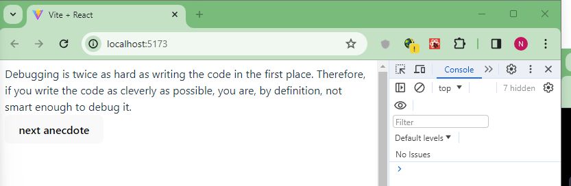
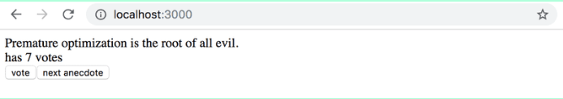
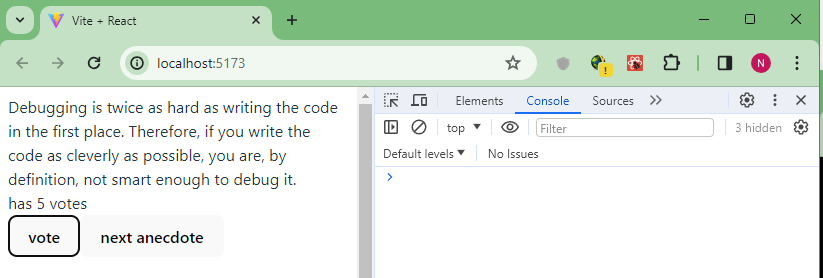
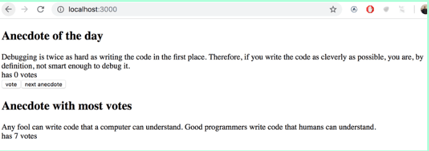
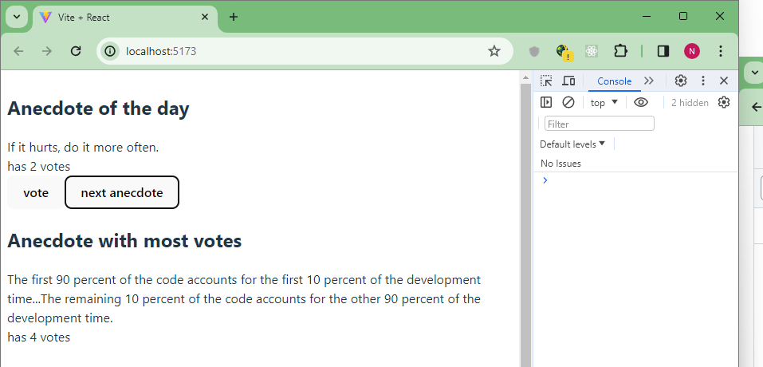

# Desarrollo de la aplicación anecdotes

### 1.12: anecdotes, paso 1

El mundo de la ingeniería de software está lleno con anécdotas que destilan verdades atemporales de nuestro campo en breves frases.

Expande la siguiente aplicación agregando un botón en el que se pueda hacer clic para mostrar una anécdota aleatoria del campo de la ingeniería de software:

```jsx
import { useState } from 'react'

const App = () => {
  const anecdotes = [
    'If it hurts, do it more often.',
    'Adding manpower to a late software project makes it later!',
    'The first 90 percent of the code accounts for the first 10 percent of the development time...The remaining 10 percent of the code accounts for the other 90 percent of the development time.',
    'Any fool can write code that a computer can understand. Good programmers write code that humans can understand.',
    'Premature optimization is the root of all evil.',
    'Debugging is twice as hard as writing the code in the first place. Therefore, if you write the code as cleverly as possible, you are, by definition, not smart enough to debug it.',
    'Programming without an extremely heavy use of console.log is same as if a doctor would refuse to use x-rays or blood tests when diagnosing patients.',
    'The only way to go fast, is to go well.'
  ]

  const [selected, setSelected] = useState(0)

  return (
    <div>
      {anecdotes[selected]}
    </div>
  )
}

export default App
```

El contenido del archivo main.jsx es el mismo de los ejercicios anteriores.

Busca como generar números aleatorios en JavaScript, por ejemplo, en un buscador o en Mozilla Developer Network. Recuerda que puedes probar la generación de números aleatorios, por ejemplo, directamente en la consola de tu navegador.

Tu aplicación finalizada podría verse así


<br>

**Solución** 

Se modificó el código del archivo App.jsx obteniendo:

```jsx
import { useState } from 'react'

const Button = (props) => (
  <button onClick={props.handleClick}>
    {props.text}
  </button>
)


const App = () => { 
  const anecdotes = [
    'If it hurts, do it more often.',
    'Adding manpower to a late software project makes it later!',
    'The first 90 percent of the code accounts for the first 10 percent of the development time...The remaining 10 percent of the code accounts for the other 90 percent of the development time.',
    'Any fool can write code that a computer can understand. Good programmers write code that humans can understand.',
    'Premature optimization is the root of all evil.',
    'Debugging is twice as hard as writing the code in the first place. Therefore, if you write the code as cleverly as possible, you are, by definition, not smart enough to debug it.',
    'Programming without an extremely heavy use of console.log is same as if a doctor would refuse to use x-rays or blood tests when diagnosing patients.',
    'The only way to go fast, is to go well.'
  ];

  const [selected, setSelected] = useState(0)

  const handleNextAnecdote = () => {
    // genera un número entero aleatorio entre 0 y la longitud de anecdotes - 1
    const randomIndex = Math.floor(Math.random() * anecdotes.length);
    setSelected(randomIndex)
  }

  return (
    <>
      <div>
        {anecdotes[selected]}
      </div>
      <div>
        <Button handleClick={handleNextAnecdote} text="next anecdote" />
      </div>
    </>
    
  )
}

export default App
```

La aplicación se ve así:


<br></br>

### 1.13: anecdotes, paso 2

Expande tu aplicación para que puedas votar por la anécdota mostrada.


<br>

Nota: almacena los votos de cada anécdota en una matriz u objeto en el estado del componente. Recuerda que la forma correcta de actualizar el estado almacenado en estructuras de datos complejas como objetos y matrices es hacer una copia del estado.

Puedes crear una copia de un objeto como este:

```jsx
const points = { 0: 1, 1: 3, 2: 4, 3: 2 }

const copy = { ...points }
// incrementa en uno el valor de la propiedad 2
copy[2] += 1
```

O una copia de una matriz como esta:

```jsx
const points = [1, 4, 6, 3]

const copy = [...points]
// incrementa en uno el valor de la posición 2
copy[2] += 1
```

El uso de una matriz podría ser la opción más sencilla en este caso. Buscar en internet te proporcionará muchos consejos sobre cómo crear una matriz llena de ceros de la longitud deseada, como .
<br>

**Solución** 

Se modificó el código del archivo App.jsx obteniendo:

```jsx
import { useState } from 'react'

const Button = (props) => (
  <button onClick={props.handleClick}>
    {props.text}
  </button>
)

// Componente que muestra la anécdota y el número de votos
const Anecdote = ({ anecdote, votes }) => (
  <>
      <div>{anecdote}</div>
      <div>has {votes} votes</div>
  </>
)

const App = () => { 
  const anecdotes = [
    'If it hurts, do it more often.',
    'Adding manpower to a late software project makes it later!',
    'The first 90 percent of the code accounts for the first 10 percent of the development time...The remaining 10 percent of the code accounts for the other 90 percent of the development time.',
    'Any fool can write code that a computer can understand. Good programmers write code that humans can understand.',
    'Premature optimization is the root of all evil.',
    'Debugging is twice as hard as writing the code in the first place. Therefore, if you write the code as cleverly as possible, you are, by definition, not smart enough to debug it.',
    'Programming without an extremely heavy use of console.log is same as if a doctor would refuse to use x-rays or blood tests when diagnosing patients.',
    'The only way to go fast, is to go well.'
  ];

  // Estado para almacenar el índice de la anécdota actual seleccionada
  const [selected, setSelected] = useState(0)

  //se crea un array de la longitud de anecdotes con sus elementos inicializados en 0
  const [votes, setVotes] = useState(Array(anecdotes.length).fill(0))

  // Manejador para cambiar a la siguiente anécdota de manera aleatoria
  const handleNextAnecdote = () => {
    // genera un número entero aleatorio entre 0 y la longitud de anecdotes - 1
    const randomIndex = Math.floor(Math.random() * anecdotes.length);
    setSelected(randomIndex)
  } 
  
  // Manejador para incrementar el número de votos de la anécdota actual
  const handleVote = () => {
    // Utiliza el método map para crear un nuevo array de votos
    // Comprueba si el índice actual es igual al índice de la anécdota actualmente seleccionada
    // Si es igual, incrementa el voto en 1 y devuelve el nuevo valor
     // Si no es igual, devuelve el voto sin cambios
    setVotes(votes.map((v, index) => (index === selected ? v + 1 : v)));
  }

  return (
    <>
      <div>
        <Anecdote anecdote={anecdotes[selected]} votes={votes[selected]}/>
      </div>
      <div>
        <Button handleClick={handleVote} text="vote" />
        <Button handleClick={handleNextAnecdote} text="next anecdote" />
      </div>
    </>
    
  )
}

export default App
```

La aplicación se ve así:


<br></br>

### 1.14: anecdotes, paso 3

Ahora implementa la versión final de la aplicación que muestra la anécdota con el mayor número de votos



Si se empatan varias anécdotas en el primer lugar, es suficiente con solo mostrar una de ellas.

Este fue el último ejercicio de esta parte del curso y es hora de enviar tu código a GitHub y marcar todos tus ejercicios terminados en el sistema de envío de ejercicios.
<br>

**Solución** 

Se modificó el código del archivo App.jsx obteniendo:

```jsx

```

La aplicación se ve así:


<br></br>

