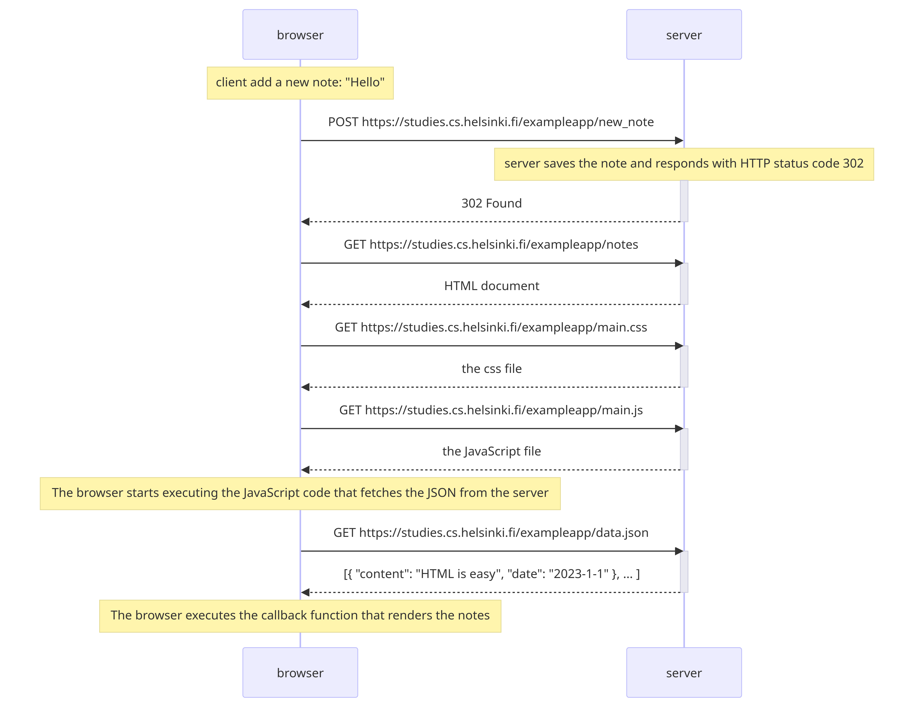
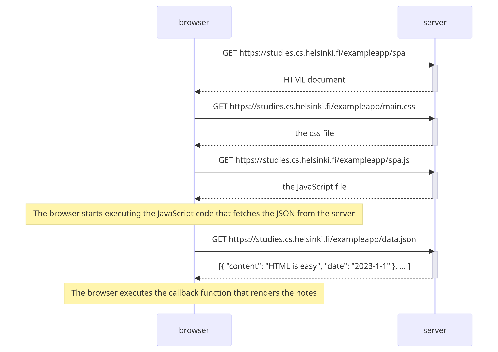
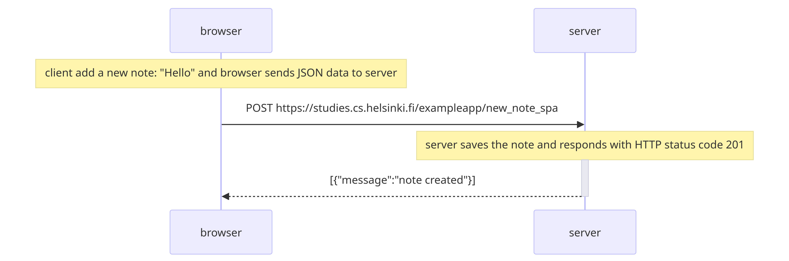
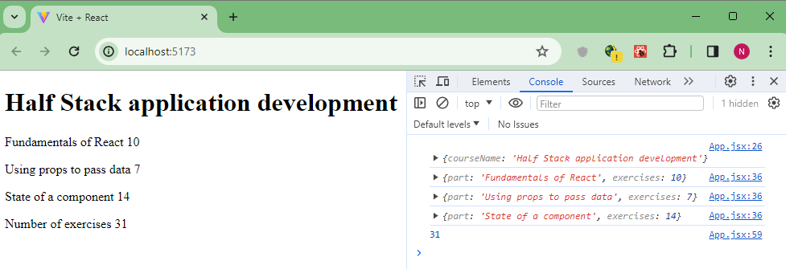

# Curso Full Stack Open
Este [curso](https://fullstackopen.com/) sirve como una introducción al desarrollo de aplicaciones web modernas con JavaScript. El enfoque principal es crear aplicaciones de una sola página con ReactJS que utilizan API REST creadas con Node.js. El curso también contiene una sección sobre GraphQL, una alternativa moderna a REST APIs.
El curso cubre las pruebas, la configuración y gestión del entorno, y el uso de bases de datos para almacenar los datos de la aplicación entre otras cosas.

En este repositorio se van a ir agregando las soluciones a los ejercicios del curso.

## **Temas**

### **Parte 0: Fundamentos de las aplicaciones web**

#### 0.4: Nuevo diagrama de nota

Crea un diagrama de secuencia que describa la situación en la que el usuario crea una nueva nota en la página https://studies.cs.helsinki.fi/exampleapp/notes escribiendo algo en el campo de texto y haciendo clic en el botón Save.

**Solución**  
El siguiente diagrama se creó usando https://www.mermaidchart.com/ con este [código](./Part0/0.4/Diagrama_de_secuencia.md)

  

#### 0.5: Diagrama de aplicación de una sola página

Crea un diagrama que describa la situación en la que el usuario accede a la versión de aplicación de una sola página de la aplicación de notas en https://studies.cs.helsinki.fi/exampleapp/spa.

**Solución**  
El siguiente diagrama se creó usando https://www.mermaidchart.com/ con este [código](./Part0/0.5/Diagrama_de_secuencia_spa.md)

  

#### 0.6: Nueva nota en diagrama de aplicación de una sola pagina

Crea un diagrama que represente la situación en la que el usuario crea una nueva nota utilizando la versión de una sola página de la aplicación.

**Solución**  
El siguiente diagrama se creó usando https://www.mermaidchart.com/ con este [código](./Part0/0.6/Diagrama_de_secuencia_spa_nueva_nota.md)

  

### **Parte 1: Introducción a React**

#### 1.1 - 1.5: información del curso

En los ejercicios 1.1 a 1.5 se desarrolló una aplicación web sencilla que muestra información del curso y cantidad de ejercicios. El código de la aplicación se puede visualizar [aquí](./Part1/courseinfo/), y la aplicación obtenida se ve así:

  

#### 1.6 - 1.11: unicafe

En los ejercicios 1.6 a 1.11 se desarrolló una aplicación web, la cuál recopila comentarios de clientes. Solo hay tres opciones para los comentarios: good (bueno), neutral y bad(malo).
 El código de la aplicación se puede visualizar [aquí](./Part1/unicafe/), y la aplicación obtenida se ve así:

  

#### 1.12 - 1.14: anecdotes

En los ejercicios 1.12 a 1.14 se desarrolló una aplicación web, la cuál muestra distintas anécdotas del campo de la ingeniería de software y permite darle votos a cada anécdota.
 El código de la aplicación se puede visualizar [aquí](./Part1/anecdotes/), y la aplicación final obtenida se ve así:

  

